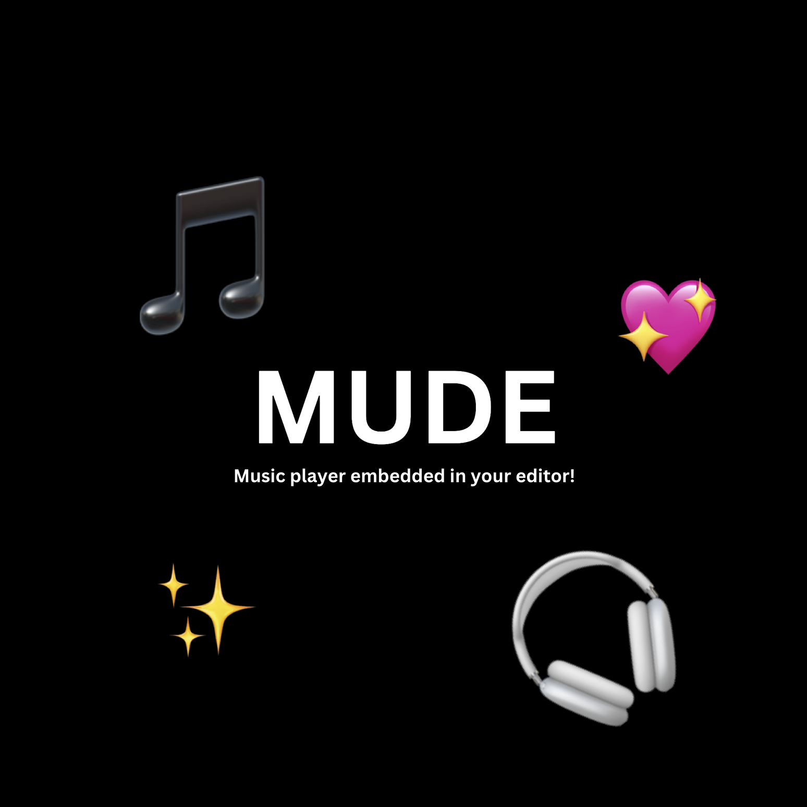

**MUDE Player** is a minimalistic music player integrated into your favorite editor, allowing you to play ad-free music from the comfort of your workspace.

## Features

- **Seamless Integration**: Control your music directly from the editor.
- **YouTube Music**: Search and play music from YouTube Music within the editor, no login, no ads.
- **Auto-Playlists**: Create playlists from your tracks and play them on the go. No need to search for music every time!
- **Playback Controls**:
    - Seek forward (+10 seconds)
    - Seek backward (-10 seconds)
    - Play/Pause
    - Next track
    - Previous track

## Requirements

- **MPV**: Ensure MPV is installed on your system to use MUDE Player.

For reference: [MPV Installation](https://mpv.io/installation/)

You can install MPV using the following command:

For macOS users:
```bash
brew install mpv
```

For Linux users:
```bash
sudo apt-get install mpv
```

For Windows users:
```bash
choco install mpv
```

## How to Contribute

Want to help make MUDE even better? You can contribute by:

- **Improving the Code**: Since this started off as a personal project, there are many areas that can be improved, bugs that can be fixed, and features that can be added. Feel free to fork the repository and make changes.

Check out the [CONTRIBUTING.md](CONTRIBUTING.md) file for more details.

## Found an Issue?

If you find a bug or have a feature request, please create an issue on the repository!

## General Rules

To keep everything smooth and consistent, please:

- Follow the project’s style and contribution rules.
- Be kind and respectful to others.
- If you’re unsure, ask questions.